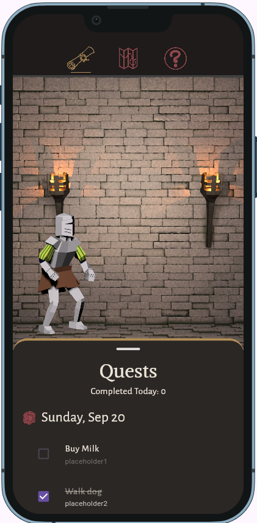
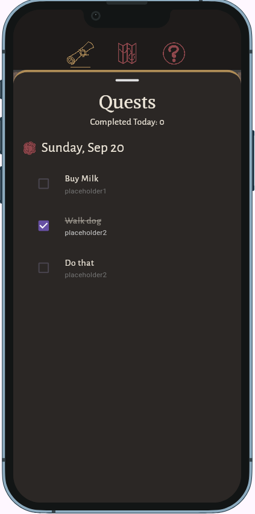
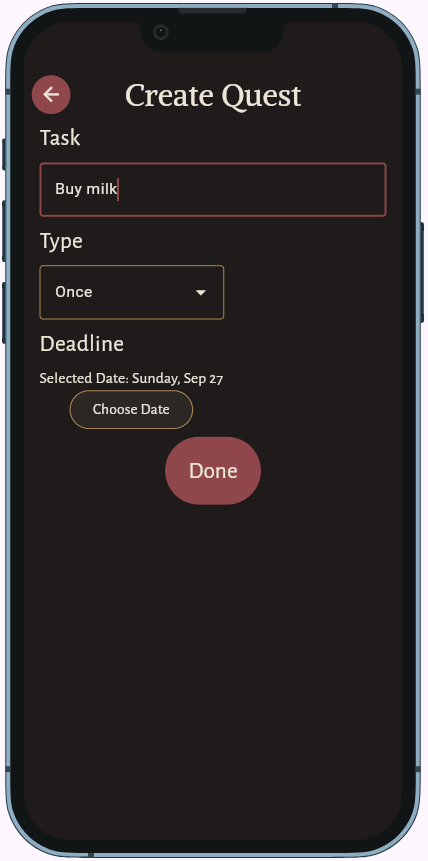
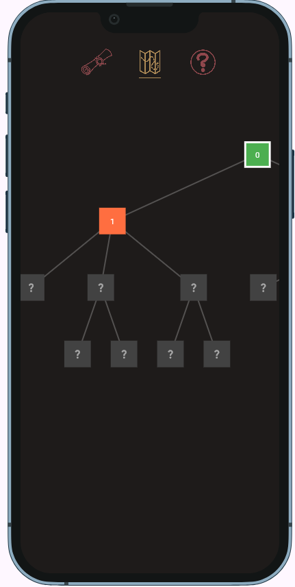
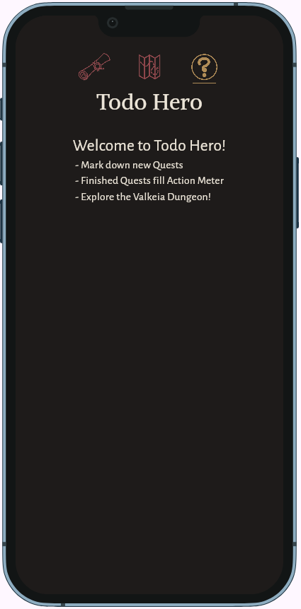

# Todo Hero

Todo Hero is a gamified todo list that combines game and productivity, intended to give motivation to procrastinators.

**Live demo:** https://YOURUSERNAME.github.io/YOUR-REPO/ <!-- GitHub Pages is set up already; replace if you host elsewhere -->

**Demo video:** `docs/demo.mp4` (link it here once it exists)

**Course:** Applications Development and Emerging Technologies (6ADET), Holy Angel University

**Author:** Rashley Allen L. Serioza

---

## Screenshots

| Main | Quests | Add | Map | Help |
| --- | --- | --- | --- | --- |
|  |  |  |  |  |

## What it does

Three to five bullets. What can a user actually do?

- Add and keep track of tasks as quests
- Traverse a map in a daily dungeon crawling
- Finish tasks to complete character actions

## Built with

| | |
| --- | --- |
| Framework | Flutter (Dart) |
| State | `setState` / provider / riverpod (say which) |
| Storage | Hive |
| Other packages | N/A |

## Running it yourself

```bash
flutter pub get
flutter run -d web-server --web-port 8080
```

Then open http://localhost:8080. Requires Flutter (run `flutter --version` and
put yours here).

## Privacy and secrets

The application will not store any personally identifiable data. No data or created task leaves this device, and everything is stored in the device.

## Project documentation

| Document | |
| --- | --- |
| [Proposal](docs/01-proposal.md) | the problem, the users, the scope |
| [Mockup and wireframes](docs/02-mockup.md) | what it looks like, and the screen flow |
| [Design system](docs/03-design-system.md) | colors, type, spacing, components |
| [Weekly reports](docs/04-weekly-reports.md) | what happened each week |
| [Demo video](docs/05-demo-video.md) | the recording and what it shows |
| [Start here](START-HERE.md) | how this repo works (delete once you have read it) |
| [Security and privacy](docs/06-security-and-privacy.md) | the checklist, filled in |

## Status and what is next

The Map and dungeon crawling feature is still half done. The Action and Action completion features are also still unimplemented. Also, assets are still not completed. The next feature that will be built will be the actions and related features.

## Credits

- Packages: see `pubspec.yaml`
- Icons and images made by me
- Alegreya Sans by Juan Pablo del Peral, HT Fonts, licensed under the [SIL Open Font License, Version 1.1](assets/fonts/Alegreya_Sans/OFL.txt)
- Alike by Sveta Sebyakina, Cyreal, licensed under the [SIL Open Font License, Version 1.1](assets/fonts/Alike/OFL.txt)

## AI use


The development of this application included the use of AI, from both guidance and actual code. For more details, visit [AI-USAGE.md](AI-USAGE.md)..

## Licence

MIT, see [LICENSE](LICENSE). 
